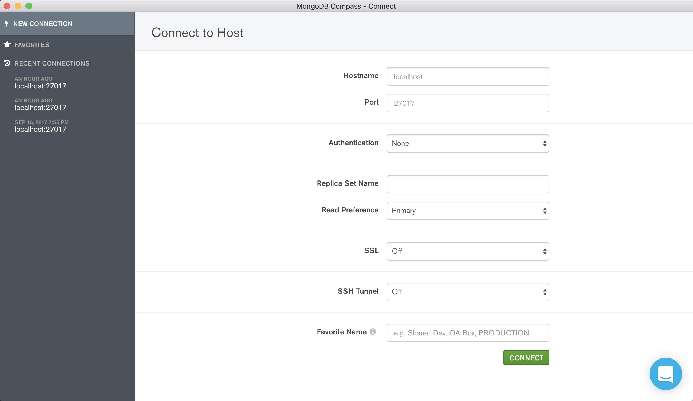
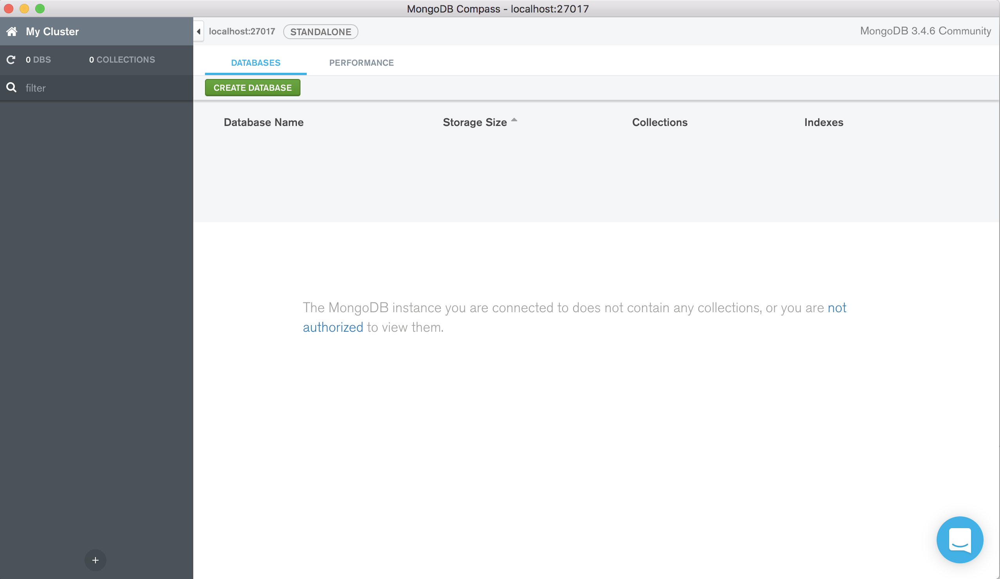
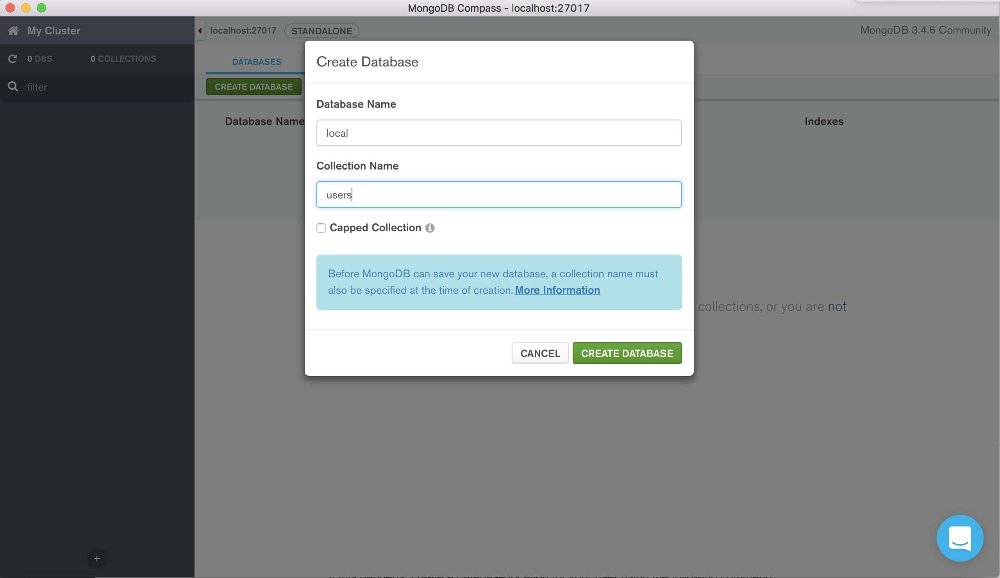
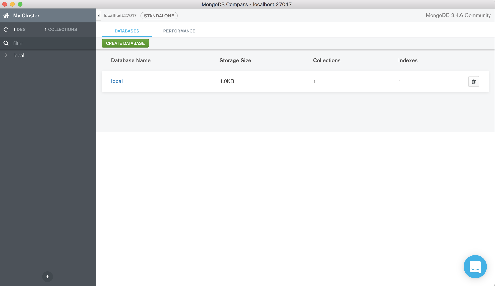
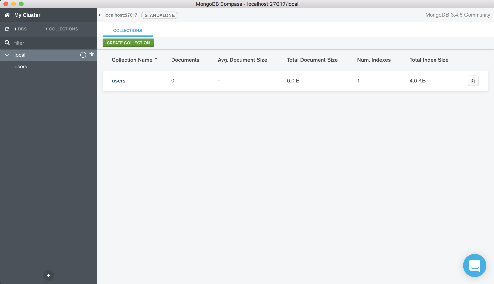
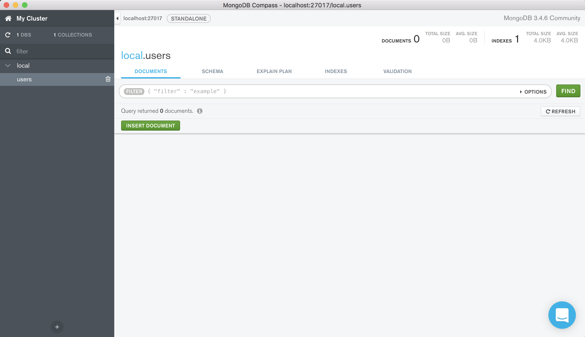
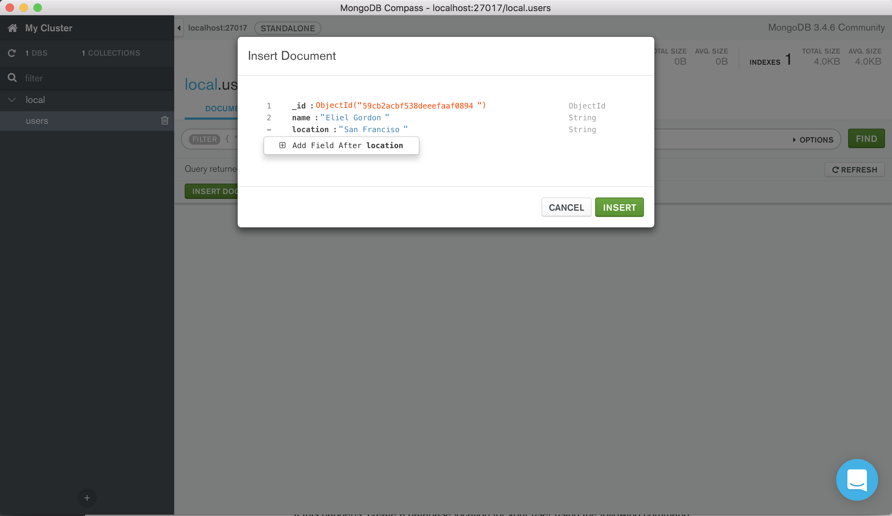
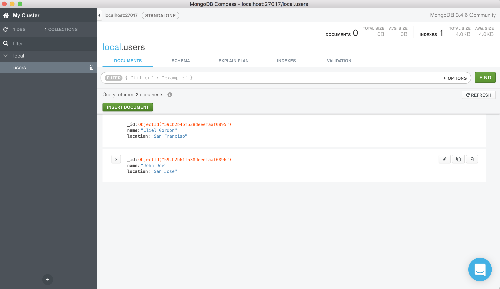

# Databases


## Objectives

- Setup mongodb
- Store data in your database
- Perform queries on your database

## Database Setup

### Installing & Running MongoDB

Another prerequisite besides python 3 is MongoDB. Whenever the flask server is running, you need to run a MongoDB instance as well. Otherwise the server won't be able to access the DB and will throw an exception.

You can test if MongoDB is installed by starting an instance of the DB with the following terminal command:

```mongod```

Upon successful start you should see the following message:

[initandlisten] waiting for connections on port 27017


Now your database is running and waiting for connections! Keep mongod running in the current terminal tab and open a new tab (CMD + T) in which you'll enter the terminal commands of the following steps. This will keep the database running which is required for your flask server to work.

If the command isn't recognized, you need to install MongoDB via homebrew:

```
brew update

brew install mongodb
```

Once the install completes you need to start the DB with this command:

```mongod```

mongod may notice that you have not specified a database directory. By default it uses /data/db. Because this folder may be missing, mongod may output the following error when run: 

Data directory /data/db not found., terminating


If this happens, create a database location for your user using the following command:

```sudo mkdir -p /data/db```

then change the ownership of the file as following:

```
sudo chown -R $USER /data/db
```

Now you should be able to run mongod.


*Note*

mongod has to be running before you can connect to your database.


### Download MongoDB Compass app

Download MongoDb Compass app:

https://www.mongodb.com/download-center?jmp=docs&_#compass


## Types of Databases

- Relational eg mySQL, postgres
- Non-relational / Document  based eg. mongodb
- Graph - neo4j

## ODM

Pymongo is an Object Document Mapper that makes interacting with our mongo database easier.

To use pymongo in your flask app, you have to import it:

```python
from pymongo import MongoClient
```

also setup pymongo and connect your database to your flask app:

```python
mongo = MongoClient('localhost', 27017)
app.db = mongo.local
```

*Note*

The database (local) matches the database we create in mongo

We access our database using attribute style access (mongo.local)
We can also use dictionary style access if you have weird characters in your database name
db = mongo['test-database']


### Documents

In mongo a single object or entry to our database is referred to as a document.

eg. a document representing a single user we create in our database.

## Collections

Collections are a group of related documents.

eg. a collection representing all the users we have in our database.


## Schema

Document based databases are schemaless, that means they don't enforce strict rules on what kind of data should be in a document/collection

You can put in a user collection these two documents:

1.
{
 'user': 'Eliel',
 'location': [-121, 122]
}

2.
{
'user': 'John',
'location': 'San Francisco'
}


## Creating/inserting a document into a collection

To insert a document in a collection, we must first grab the collection we wish to insert our document in:

```python

# Users from POST request
users_dict = request.json

# Our users collection
users_collection = app.db.users

# Inserting one user into our users collection
result = users_collection.insert_one(
    users_dict
)

```

## Fetching(Finding) documents from a collection aka Querying

### Finding one document:

Find one will find the first document that matches the query defined.

Eg below will find and return the first user with age that matches the query


[Mongodb inserting a document](http://api.mongodb.com/python/current/tutorial.html#inserting-a-document)

```python

user_age_dict = request.args

# Grab user age from dict and and convert to integer for querying

@app.route('/users', method=['GET'])
def get_user_by_age():

    user_age_dict = request.args
    
    user_age = int(user_age_dict['age'])

    users_collection = app.db.users

    result = users_collection.find_one({'age': user_age})

    response_json = JSONEncoder().encode(result)

    return (response_json, 200, None)

    
```

Read the mongodb docs for fetching a single document:

[Fetching documents](http://api.mongodb.com/python/current/tutorial.html#getting-a-single-document-with-find-one)


## JSON Serialization with Flask and Mongodb BSON

There are a couple of ways to serialize and deserialize json in python. We have the json module that will help us with that.

But for Mongo, which stores it data as BSON, the json module doesnt know how to serialize nested composite types (ObjectId is an example).

### Method 1 - Using Pymongo helpers:

We can import these modules from the pymongo library to help us serialize those types:

```python
from bson import Binary, Code
from bson.json_util import dumps
```

To serialize our object to return as a response we run this function:

```python

@app.route('/my_route')
def my_route()
    my_dict_from_json = request.json

    json_representation = dumps(my_dict_from_json)

    return  (json_representation, 200, None)

```


### Method 2 - Using a custom JSON encoder / serializer

1. Create a separate file with this:

```python

import json
from bson.objectid import ObjectId

# Custom JSONEncoder that extracts the strings from MongoDB ObjectIDs
# Thanks to http://stackoverflow.com/questions/16586180/typeerror-objectid-is-not-json-serializable
class JSONEncoder(json.JSONEncoder):
    def default(self, o):
        if isinstance(o, ObjectId):
            return str(o)
        return json.JSONEncoder.default(self, o)

```

2. To serialize our json we do this:

```python

from my_file_name import JSONEncoder

@app.route('/my_route')
def my_route()
    my_dict_from_json = request.json

    json_representation = JSONEncoder.encode(my_dict_from_json)

    return  (json_representation, 200, None)

```


## Using Mongodb Compass

We will use the mongodb compass app to create our first mongo database and collection.


1. First we have to connect to mongodb. Make sure you are running mongod in terminal!



2. Create a new database by clicking then "create database" button



3. Name your database "local" and create a "users" collection



4. You should see your newly created database listed 



5. Click on your databas "local", you should see your users collection 



6. Click on "insert document" button to insert a document in the users collection



7. Add a "name" and "location" property with values



8. Insert a few documents



## Resources

[Pymongo Docs](http://api.mongodb.com/python/current/tutorial.html)


## Challenges

1.

    a. Use the Mongod Compass app to create a database called local, and a collection called users.
    
    b. Create 2-5 user documents in your collection with the following properties:

    - name - string
    - age - number
    - location - string

2.

    a. Create another collection called *courses* with the following or more properties:

    - name - string
    - number - number
    - students - an array of students

    b. Create 2-5 course documents


3.

    a. Import pymongo into a flask project. Setup your mongo database and add it to your flask app.

    b. Create a 'courses' route that handles a post request to create a course

    c. Make sure that before the course is inserted into our database, it has these two properties of a course:

    - name - string
    - number - number

    d. Test your post route with a post request in Paw/postman/curl

    e. Handle a get request to "courses" that looks for a course number from the url parameter, returns a 400 error if the course number parameter doesn't exit, and uses the course number to search our database courses collection for a document with the specified course number. Return a 200 and the course if its found.

    e. Handle a get request to "courses" route that fetches and returns to the user all the courses in the database.

    f. Create another route called "count_courses" that returns the number of course documents in our database.


4. 
    Create a cart *carts* collection and route that handles a user's cart items:

    Cart structure examples looks like this below:
    
    ```javascript
    {
      "user": "Eliel",
      "items": [
        {
          "brand": "Coke",
          "quantity": 4
        },
        {
          "brand": "Fanta",
          "quantity": 1
        }
      ]
    }
    ```
    
    Its made up of a user and an array of items with a brand and quantity.

    We want to be able to update our cart with either more items, or change the quantity of one item

    a. Create a route that handles a patch request that updates a user's cart items 


*Hint* Remember to get your collection then perform actions on it.


