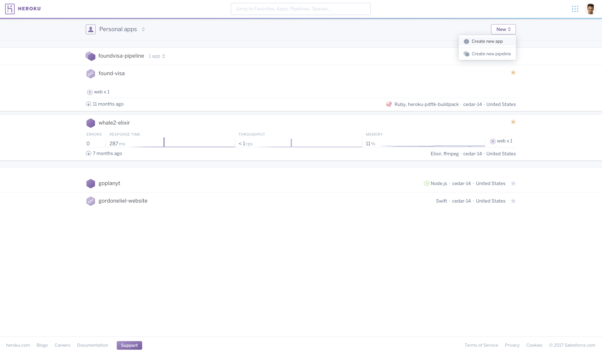
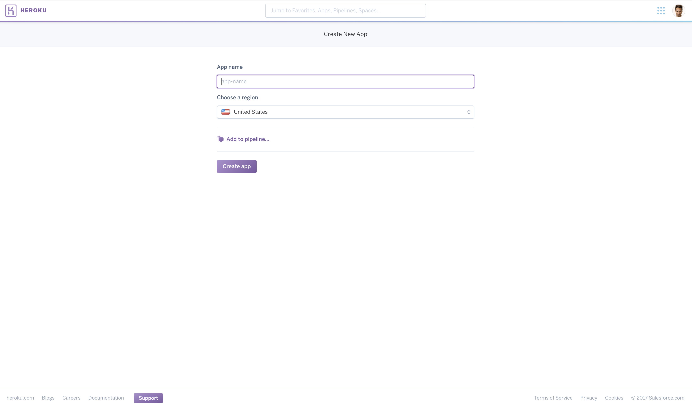

# Deployment

## Objectives

- Learn about the options for deploying your web app to the internet
- Learn how to push your web app to Heroku
- Learn how to provision a database on Heroku and attach to your app


## Options for deployment

- AWS EC2
- Heroku
- Digital Ocean

## Deploying

We will be deploying our TripPlanner server to Heroku. To do that, we need to deploy our python app, and also create an mongo database instance online.


## Creating a database instance on Mlabs


1. Visit to mLabs (https://www.mlab.com) and create and account and database.

2. Connect your server to the mLabs database


## Deploying to Heroku

1. Sign up to Heroku(www.heroku.com) and Install the heroku toolbelt. Follow the instructions here https://devcenter.heroku.com/articles/heroku-cli#download-and-install

2. Install gunicorn with: 

```pip install gunicorn```

3. Add gunicorn to your requirements.txt with: 

```pip freeze > requirements.txt```

4. Create a Procfile. This is a special file used by heroku to configure your server and environment.

    a. Create a file called "Procfile" with no extensions.
    b. Paste this into the file ```web: gunicorn app:app```
    

5. Run your server and make sure its working!

6. Create a new app in Heroku





7. Make sure your app is under version control (Git)
    a. git add
    b. git commit -m ""
    c. git push heroku
